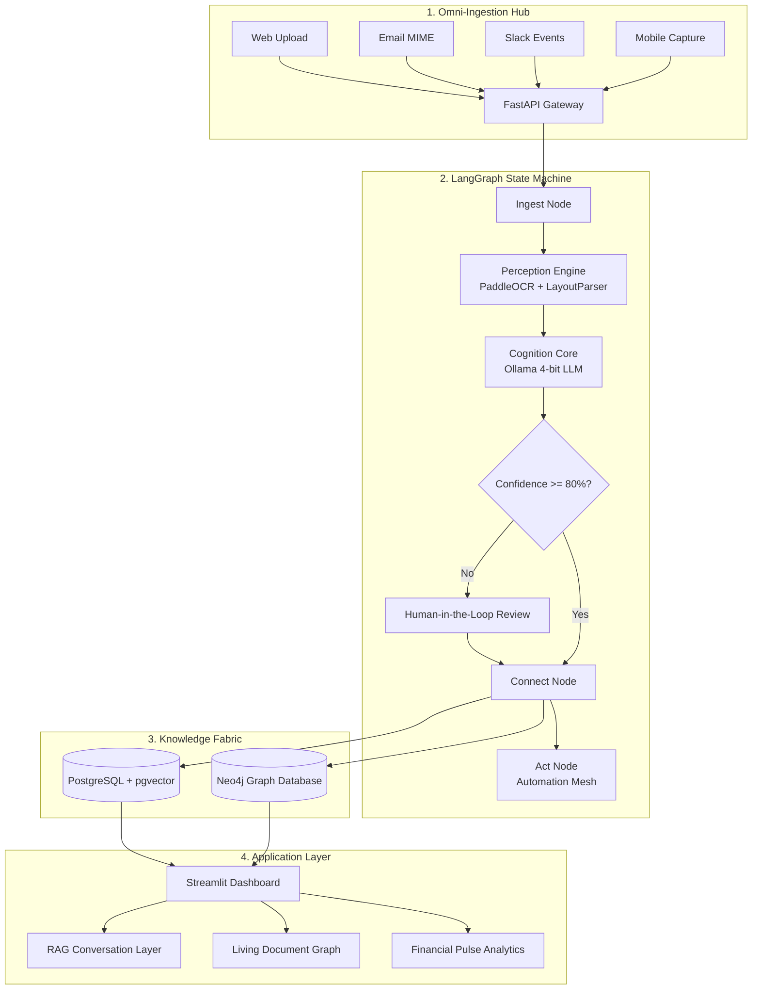
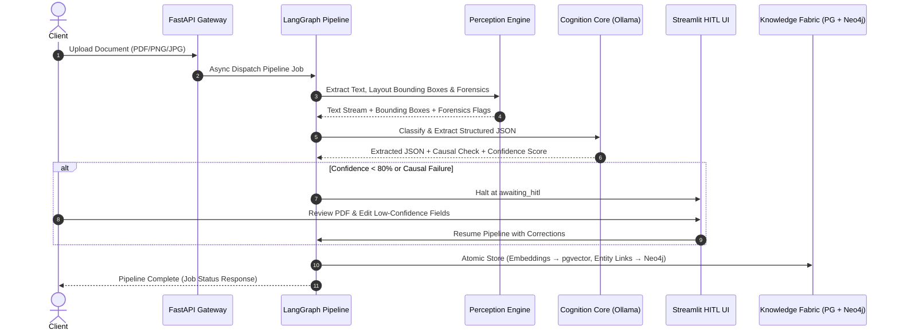
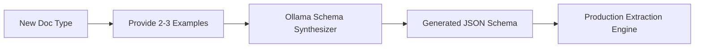
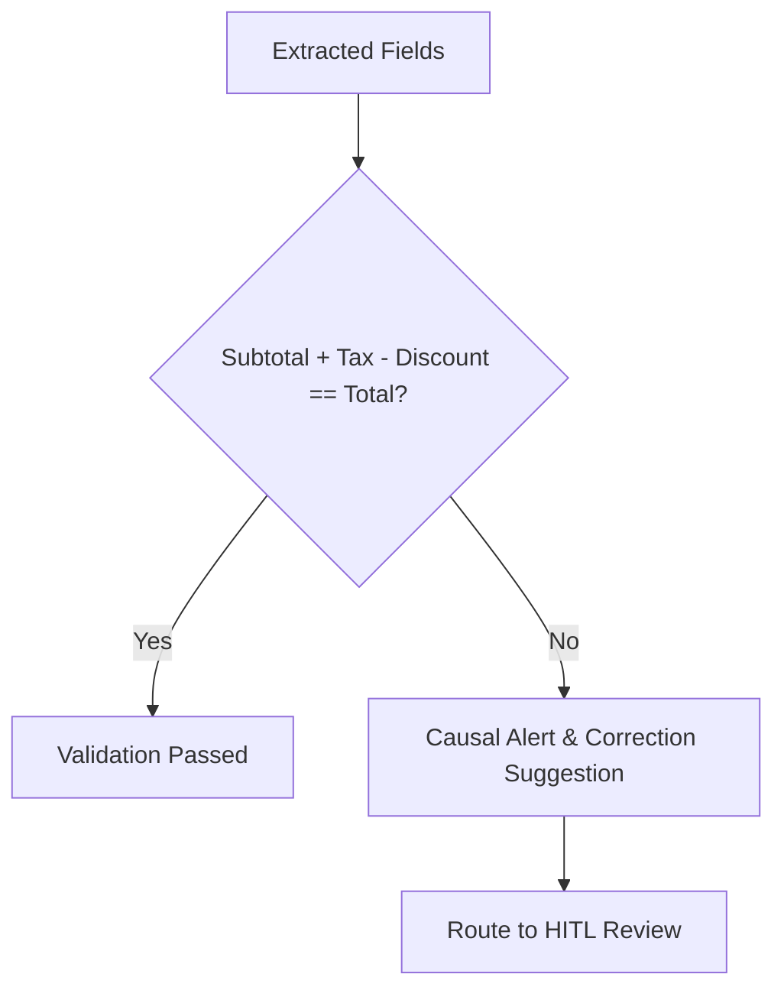
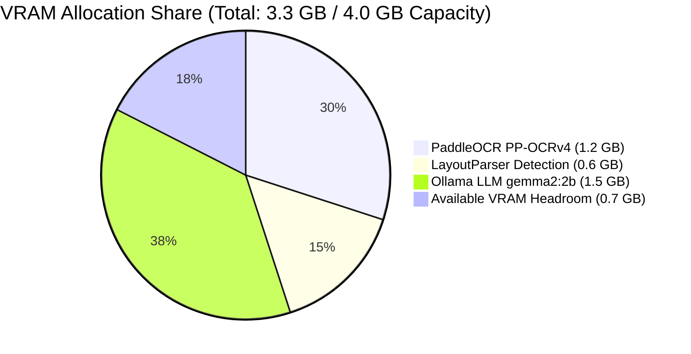

<div align="center">

  <h1>DocuMind AI</h1>
  <h3><em>Autonomous Document Intelligence Fabric for Enterprise & SMEs</em></h3>

  <p>
    <a href="https://github.com/Harshithreddy-ux/DOCUMIND-AI/blob/main/LICENSE"></a>
    <a href="https://github.com/Harshithreddy-ux/DOCUMIND-AI/actions"></a>
    
    
    
    
    
  </p>

  <p>
    <strong>Transforming unstructured business documents (invoices, contracts, receipts, purchase orders) into a structured, queryable knowledge graph with automated decisioning and human-in-the-loop governance.</strong>
  </p>

  <p>
    <a href="#-system-architecture">Architecture</a> •
    <a href="#-document-processing-workflow">Workflow</a> •
    <a href="#-quick-start-windows-11">Quick Start</a> •
    <a href="#-core-innovations">Innovations</a> •
    <a href="#-api-reference-summary">API Reference</a> •
    <a href="#-author--maintainer">Author</a>
  </p>

</div>

---

## 🏛️ System Architecture



---

## 🔄 Document Processing Workflow



---

## ⚡ Quick Start (Windows 11)

### Prerequisites
- Windows 11 Desktop
- Docker Desktop (running)
- Python 3.10+
- [Ollama](https://ollama.ai) (with `gemma2:2b-instruct-q4_K_M` and `nomic-embed-text`)

### 🚀 One-Click Launch
Double-click `start.bat` in Windows Explorer or execute in your terminal:

```cmd
start.bat
```

`start.bat` automatically:
1. Boots PostgreSQL (`pgvector`) & Neo4j containers (`docker-compose up -d`).
2. Waits 5 seconds for database readiness.
3. Launches **FastAPI Gateway** on `http://localhost:8000` in a dedicated terminal.
4. Launches **Streamlit Dashboard** on `http://localhost:8501` in a dedicated terminal.
5. Launches **Cloudflare Tunnel** for webhooks if `cloudflared` is installed.

---

## 🌐 Endpoints & Dashboards

| Service | Access URL | Function |
|---|---|---|
| 📊 Streamlit Dashboard | `http://localhost:8501` | Multi-page UI (Ingestion, HITL, Graph, RAG Chat) |
| ⚡ FastAPI Gateway | `http://localhost:8000` | Asynchronous REST API & Webhook Handlers |
| 📖 Interactive API Docs | `http://localhost:8000/docs` | OpenAPI / Swagger Documentation |
| 🗄️ Neo4j Browser | `http://localhost:7474` | Cypher query console & raw graph inspection |

---

## 💡 Core Innovations

### 1. Few-Shot Schema Synthesis
Adapt to any new document type from 2-3 examples in under 30 seconds without pre-defined templates:



### 2. Cross-Document Causal Validation
Ensures mathematical and logical consistency across extraction fields before persistence:



### 3. Self-Healing Active Learning
Low-confidence extractions are gated by human verification, continuously enriching training data for local model refinement.

---

## 📁 Project Structure

```
DOCUMIND-AI/
├── state.py          # Central LangGraph TypedDict state definition
├── perception.py     # PaddleOCR + LayoutParser + visual entropy forensics
├── cognition.py      # Few-Shot Schema Synthesis, Extraction & Causal Validation
├── graph.py          # LangGraph StateGraph with conditional HITL edge
├── knowledge.py      # PostgreSQL/pgvector & Neo4j graph persistence
├── main.py           # FastAPI gateway with async background execution
├── app.py            # Streamlit multi-page dashboard
├── start.bat         # Windows 11 automated batch launcher
├── docker-compose.yml# PostgreSQL (pgvector) & Neo4j setup
└── tests/            # Pytest test suite
```

---

## 🧮 Hardware & VRAM Budget (≤ 4GB VRAM)



| Component | Execution Unit | Memory Usage |
|---|---|---|
| PaddleOCR PP-OCRv4 | GPU (fp16) | 1.2 GB |
| LayoutParser PaddleDetection | GPU | 0.6 GB |
| Ollama `gemma2:2b-instruct-q4_K_M` | GPU (4-bit) | 1.5 GB |
| `nomic-embed-text` | CPU | 0.0 GB |
| **Total Allocated** | **GPU** | **3.3 GB** (0.7 GB Headroom) |

---

## 📡 API Reference Summary

```http
POST   /upload              Upload document file for processing
POST   /webhook/slack       Ingest file_shared events from Slack
POST   /webhook/email       Ingest email attachments
GET    /status/{job_id}     Poll job status and pipeline stage
POST   /hitl/{job_id}       Submit human corrections to resume pipeline
GET    /documents           Retrieve processed documents
GET    /graph               Export Neo4j graph nodes and edges
GET    /search?q={query}    Semantic vector search over document corpus
GET    /health              Health check endpoint
```

---

## 👨‍💻 Author & Maintainer

**Harshith Reddy Pujari**  
*Principal Architect & Systems Developer*  
- GitHub: [@Harshithreddy-ux](https://github.com/Harshithreddy-ux)  
- Email: pujariharshithreddy@gmail.com  

---

## 📄 License
This project is licensed under the [MIT License](LICENSE).
