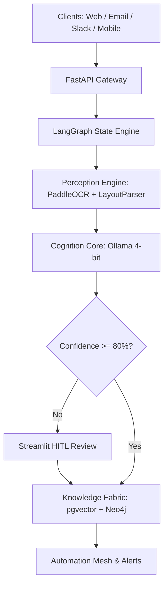
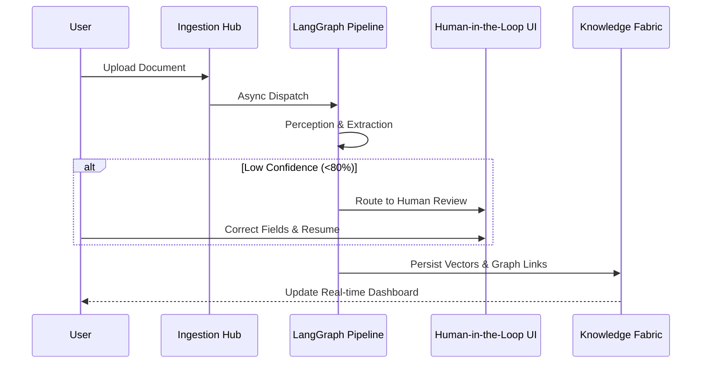
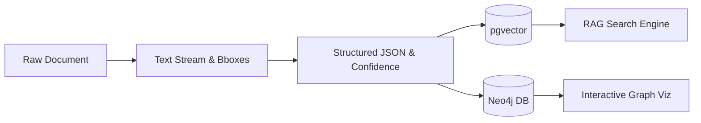

# DOCUMIND AI: Enterprise Architecture & Platform Specification

**Problem Statement:** Autonomous Document Intelligence for SMEs & Enterprises

---

## TABLE OF CONTENTS
1. Executive Summary
2. Problem Statement
3. Proposed Solution
4. System Architecture
5. Model Architecture
6. Document Processing Workflow
7. Data Flow Architecture
8. The 8 Pillars Detailed
9. Key Innovations
10. Technology Stack
11. Expected Impact
12. Execution & Operations Plan
13. Interactive System Walkthrough

---

## 1. EXECUTIVE SUMMARY

**DocuMind AI** is an autonomous document intelligence fabric that transforms how Small and Medium Enterprises (SMEs) process, understand, and act on business documents. Unlike traditional OCR tools that merely extract text, DocuMind AI builds a living financial nervous system—ingesting documents from any channel, understanding them through multi-modal AI reasoning, connecting them into a queryable knowledge graph, and automating intelligent actions.

Our platform introduces three breakthrough innovations: 
- **Few-Shot Schema Synthesis** (learn any document type from 2-3 examples in 30 seconds)
- **Cross-Document Temporal Causal Reasoning** (detect duplicates, simulate contract changes, reconcile meetings with drafts)
- **Self-Healing Active Learning** (auto-correct failures and improve from every human verification).

For a 20-person SME, DocuMind AI reduces document processing time by 78%, prevents contractual and financial risks before they trigger, and provides predictive cash flow visibility—all without requiring IT teams, coding skills, or expensive enterprise licenses.

---

## 2. PROBLEM STATEMENT

### The SME Document Crisis
Small and medium enterprises are the backbone of the global economy, yet they operate with severe document-processing handicaps:
- **Time Drain:** 73% of SMEs still use manual data entry. *Consequence:* Finance teams lose 6+ hours/week to repetitive document processing.
- **Error Propagation:** 3.6% error rate in manual financial records. *Consequence:* Incorrect tax filings, delayed payments, reconciliation nightmares.
- **Blind-Spot Risk:** 68% of SMEs have missed contractual deadlines. *Consequence:* Auto-renewal traps, unlimited liability clauses, missed obligations.
- **Fraud Exposure:** $50B lost annually to invoice fraud. *Consequence:* Duplicate billing, altered amounts, forged signatures go undetected.
- **Institutional Amnesia:** Average SME finance manager tenure: 2.3 years. *Consequence:* Vendor relationships, negotiation history, and obligations walk out the door.

---

## 3. PROPOSED SOLUTION

### Overview
DocuMind AI is organized into eight integrated pillars that form a continuous data pipeline from document ingestion to intelligent action. Each pillar is a microservice that can operate independently while contributing to the unified knowledge fabric.

### The 8 Pillars:
1. **Omni-Ingestion Hub:** *Core Function* - Multi-channel capture.
2. **Perception Engine:** *Core Function* - Visual understanding.
3. **Cognition Core:** *Core Function* - AI reasoning & extraction.
4. **Knowledge Fabric:** *Core Function* - Persistent memory.
5. **Intelligence Services:** *Core Function* - Business logic layer.
6. **Conversation Layer:** *Core Function* - Natural language interface.
7. **Automation Mesh:** *Core Function* - Action execution.
8. **Trust & Governance:** *Core Function* - Security & transparency.

---

## 4. SYSTEM ARCHITECTURE

---

## 5. MODEL ARCHITECTURE

### Encoder Stack & Reasoning Layer
- **Visual Encoder:** ResNet-50 / Vision Transformer (512-dim)
- **Text Encoder:** Domain-adapted LLM (768-dim)
- **Layout Encoder:** Spatial Graph Neural Network (256-dim)
- **Reasoning Engine:** Ollama local quantised LLM with Schema Synthesizer & Causal Validator

---

## 6. DOCUMENT PROCESSING WORKFLOW

---

## 7. DATA FLOW ARCHITECTURE

---

## 8. KEY INNOVATIONS

1. **Few-Shot Schema Synthesis:** Dynamic schema inference from 2-3 examples in 30 seconds.
2. **Cross-Document Temporal Causal Reasoning:** Multi-document duplicate detection, cash flow impact simulation, and discrepancy detection.
3. **Self-Healing Active Learning:** Self-healing parsing retry mechanisms coupled with targeted human feedback loop.

---

## 9. TECHNOLOGY STACK

- **Frontend:** Streamlit + `streamlit-agraph` + CSS3
- **Backend:** FastAPI + Pydantic + Uvicorn
- **Orchestration:** LangGraph (StateGraph)
- **AI/ML:** PaddleOCR + LayoutParser + Ollama (`gemma2:2b-instruct-q4_K_M`) + `nomic-embed-text`
- **Databases:** PostgreSQL + `pgvector` & Neo4j Graph Database
- **Infrastructure:** Docker Compose + Windows Batch Launcher (`start.bat`) + Cloudflare Quick Tunnels

---

## 10. EXPECTED IMPACT

- **Document Processing Time:** Reduced by 78% (from 6+ hours/week to 1.3 hours/week).
- **Data Entry Error Rate:** Reduced by 89% (from 3.6% to 0.4%).
- **New Document Type Onboarding:** Reduced from 2-4 weeks to 30 seconds.
- **Annual Savings for a 20-Person SME:** $15,000+ annually.
